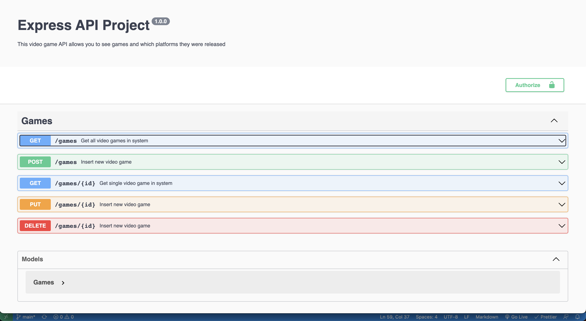
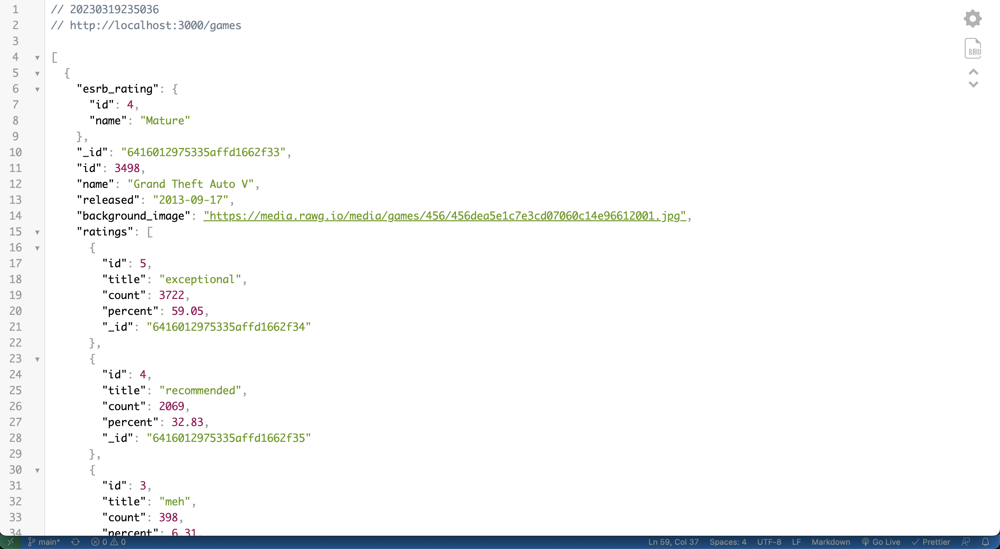

# RESTful Video Game API

Build a RESTful JSON API with full CRUD using MongoDB, Express and Mongoose

## About

This API was inspired by my love and passion for video games. I am a collector of video games and having a database of games and what platforms they're on is very useful to myself.
The API was created using:

- [RAWG.io](https://api.rawg.io/)

## How to start Project

1.  Clone repository

        clone repo

2.  Switch to repository

        cd into repo

3.  Install depandencies

        npm install

4.  Change into db directory

        cd lib/db

5.  Seed database

        node gameSeed.js

6.  Change to lib directory

        cd ..

7.  Launch server

        npx nodemon index.js

8.  Open browser and run below url

[http://localhost:3000/](http://localhost:3000/)

## Games Endpoints

| URL         | PATH       | METHOD | DESCRIPTION                         |
| ----------- | ---------- | ------ | ----------------------------------- |
| /           | /          | GET    | Will redirect to /games             |
| /games      | /games     | GET    | List all items of games             |
| /games      | /games     | POST   | Add a new game to the database      |
| /games/{id} | /games/:id | GET    | Render game based on the id         |
| /games/{id} | /games/:id | PUT    | Update a specific game based off ID |
| /games/{id} | /games/:id | DELETE | Remove a specific game based on ID  |

## API Doc

  

## Technology Used

- Mongoose
- Express.js

   

## Future Plans

I would like to incorporate load testing so I can test the performance of the api. Also, adding a front end to show all of the data in a more clean way. There are somme issues with the swagger docs that will need to be resolved as well. Adding swagger to the project was one of my biggest hurdles.
